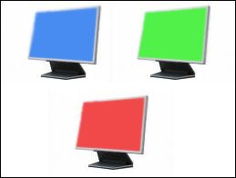

## Test LCD

### Description

With this program you can find bad pixels on your LCD monitor. The code is very simple.
 
### More Info
 

             |
---                |---
**Submitted On**   |2007-03-01 21:49:04
**By**             |[Safo](https://github.com/Planet-Source-Code/PSCIndex/blob/master/ByAuthor/safo.md)
**Level**          |Beginner
**User Rating**    |4.3 (13 globes from 3 users)
**Compatibility**  |VB 6\.0
**Category**       |[Graphics](https://github.com/Planet-Source-Code/PSCIndex/blob/master/ByCategory/graphics__1-46.md)
**World**          |[Visual Basic](https://github.com/Planet-Source-Code/PSCIndex/blob/master/ByWorld/visual-basic.md)
**Archive File**   |[Test\_LCD2065325122007\.zip](https://github.com/Planet-Source-Code/safo-test-lcd__1-68025/archive/master.zip)

